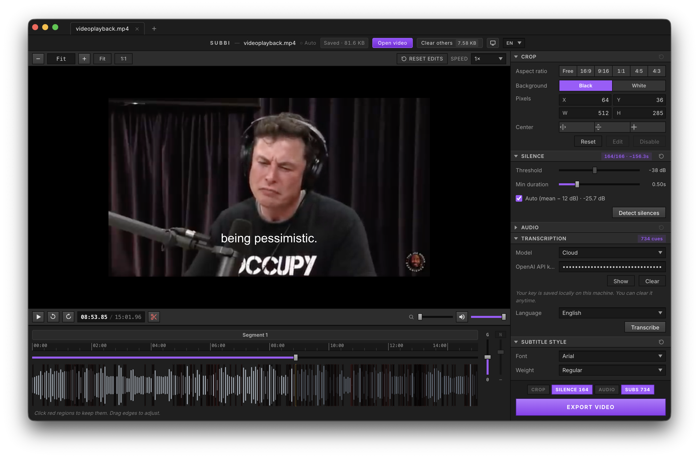

<div align="center">


# Subbi

**Drop a video, get burned-in subtitles. Local, offline, open-source.**

Transcribe with Whisper, style the subtitles like a pro, cut silences, crop for vertical or square aspect ratios, clean up audio — all in one desktop app. No subscription. No uploads. No watermark. Fork it, ship it, use it for whatever you want.

<br />



</div>

---

## What you can do with it

- **Auto-transcribe** any video to subtitles using local Whisper (offline) or the OpenAI API (cloud).
- **Style your subtitles** — font, weight, size, color, outline, position, casing, words-per-line.
- **Edit the cues** inline on a real waveform timeline.
- **Cut silences** automatically (auto-threshold or manual dB).
- **Crop** your video to any aspect ratio (16:9, 9:16 for Reels/Shorts, 1:1, 4:5, 4:3, or free-form).
- **Boost volume + noise gate** in a single export pass.
- **Burn subtitles into the video** or export a clean `.srt`.
- **Work on up to 3 projects at once** with auto-save.
- **English & Spanish UI** out of the box.

---

## Transcription engines

You choose. Switch any time.

### Local (Whisper.cpp) — default, offline, private

Bundled at install. Three models trade size for accuracy:

| Model | File | Size | Best for |
| --- | --- | --- | --- |
| Tiny | `ggml-tiny.bin` | ~75 MB | Quick drafts, short clips |
| Medium | `ggml-medium.bin` | ~1.5 GB | Balanced everyday use |
| Large v3 | `ggml-large-v3.bin` | ~3.1 GB | Maximum accuracy |

Runs on CPU, multi-threaded. Languages: Spanish, English, Portuguese, or auto-detect.

### Cloud (OpenAI Whisper API)

Bring your own API key. Subbi handles MP3 extraction and 24 MB chunking automatically for long videos. Useful when you don't want to download the local models or need higher accuracy on a slow machine.

---

## Subtitle styling

Every option you'd expect from a video editor, exposed as a control:

- **Font family** — Arial, Helvetica, Verdana, Tahoma, Georgia, Times New Roman, Courier New, Impact, Comic Sans MS
- **Font weight** — Normal, Semibold, Bold
- **Size** — pixel height
- **Text color** — hex picker
- **Outline** — toggle on/off, color, width
- **Vertical & horizontal margins** — as % of video dimensions
- **Text case** — As-is, UPPERCASE, lowercase
- **Max words per line** — auto-resegments the cues, redistributing timings proportionally
- **Apply to all segments** — one click to push a style across the whole project

Rendering is done through ASS (Advanced SubStation Alpha) for precise positioning and burned in with ffmpeg.

---

## Timeline & editing

- **Waveform** powered by WaveSurfer.js — click to seek, see audio peaks at a glance.
- **Inline cue editing** — click a subtitle, type, Enter to save, Esc to cancel.
- **±5s nudge buttons** and zoom controls (`Cmd/Ctrl + +/−/0`).
- **Segment split markers** — break a video into segments and export them as separate files.
- **Live preview** — see your styled subtitle on top of the actual frame.

---

## Silence detection

- **Auto threshold**: `mean volume − 12 dB`, or set your own in dB.
- **Min duration filter** (default 0.5s) avoids cutting micro-pauses.
- **Visual regions** on the timeline — click to toggle keep/cut, drag the edges to refine.
- Exports a re-encoded `.nosilence.mp4` with the silent sections removed.

---

## Cropping

- 8-handle visual drag (N, S, E, W, and corners).
- **Aspect ratio presets**: Free, 16:9, 9:16, 1:1, 4:5, 4:3.
- **Fit / Fill** quick buttons.
- **Padding** with black or white when the crop goes outside the frame.
- **Multiple crop zones** per project — switch between framings without re-editing.

---

## Audio processing

- **Gain** — boost or attenuate in dB.
- **Noise gate** — threshold from −20 to −80 dB, using ffmpeg's `afftdn` to drop background hum while preserving voice.

---

## Export

Everything happens in a single ffmpeg pipeline:

- **Video**: H.264 (libx264, CRF 20), `+faststart` for streaming.
- **Audio**: AAC 192 kbps.
- **Subtitles**: SRT file, ASS file, or burned into the video.
- **Multi-segment export**: one output per active segment.
- **Progress bar** with cancel mid-render.
- **Supported inputs**: mp4, mov, mkv, webm, avi, m4v.

---

## Productivity

- **Tabs** — up to 3 projects open at once, each auto-saved to local storage.
- **Storage stats** — see how much disk your projects are using; clear old ones in a click.
- **Reset per section** — wipe just the crop, just the silence, just the subtitles, or just the audio without touching the rest.
- **Drag & drop** a video file onto the window to load it.
- **Dark / Light / System** theme.

---

## Privacy

- Local transcription runs entirely on your machine — nothing leaves it.
- ffmpeg and Whisper models are bundled at install, not fetched at runtime.
- OpenAI mode only sends audio if you explicitly enable it and provide a key.
- API keys are stored in your local app storage. They never reach Subbi (because there is no Subbi server).

---

## Platforms

- **macOS** — Apple Silicon (arm64), shipped as `.pkg`.
- **Windows** — x64, NSIS installer.
- **Linux** — generic build.

---

## Install (from source)

```bash
git clone <repo-url> subbi
cd subbi
npm install
```

`npm install` also downloads the three Whisper models into `resources/whisper/` (about 4.7 GB total). One-time. If it gets interrupted, run `npm run setup:models` again.

## Run in dev

```bash
npm run dev
```

## Build a release

```bash
npm run package
```

Output appears in `release/`.

---

## Tech stack

- [Electron 33](https://www.electronjs.org/) — desktop shell
- [React 18](https://react.dev/) + [Tailwind CSS 3](https://tailwindcss.com/)
- [whisper.cpp](https://github.com/ggerganov/whisper.cpp) — local transcription
- [ffmpeg-static](https://github.com/eugeneware/ffmpeg-static) — bundled ffmpeg
- [WaveSurfer.js 7](https://wavesurfer.xyz/) — waveform visualization
- [OpenAI Whisper API](https://platform.openai.com/docs/guides/speech-to-text) — optional cloud engine

---

## License

Open source. Use it, modify it, ship it.
